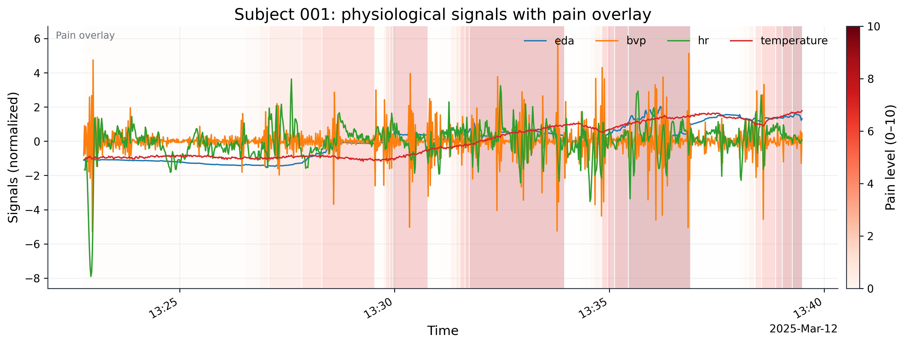
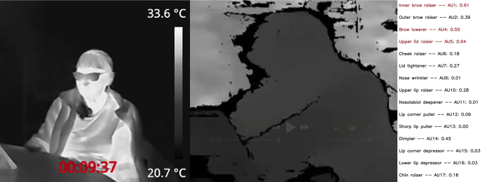

# SILVER-Pain Dataset

A multimodal pain-assessment dataset across young and older adults with aligned physiological and self-report signals.

[](LICENSE)


## At a Glance

| Item | Details |
| --- | --- |
| Participants | 25 total (`18` young adults, `7` older adults) |
| Core wearable signals | BVP, EDA, skin temperature, HR / systolic peaks |
| Video-derived modalities | Depth video, thermal video, facial action unit (FAU) features |
| Ready-to-use outputs | `data/young_adults/young_adults.csv/.feather`, `data/older_adults/older_adults.csv/.feather` |
| Reproducible pipelines | `process_young_adults_data.py`, `process_older_adults_data.py` |
| Dataset host | [Mendeley Data: m38f8ydn49](https://data.mendeley.com/datasets/m38f8ydn49) |

---

<figure style="text-align: center;">
  
  <figcaption style="font-style: italic;">Sample physiological signals with aligned pain annotations.</figcaption>
</figure>

<figure style="text-align: center;">
  
  <figcaption style="font-style: italic;">Overview of video-related modalities used in SILVER-Pain. </figcaption>
</figure>

---

## Table of Contents

- [Why This Dataset Matters](#why-this-dataset-matters)
- [What’s Included](#whats-included)
- [Cohorts and Devices](#cohorts-and-devices)
- [Modalities](#modalities)
- [Data Quality Notes and Caveats](#data-quality-notes-and-caveats)
- [Download and Data Placement](#download-and-data-placement)
- [Quick Start](#quick-start)
- [Repository Structure](#repository-structure)
- [Citation](#citation)
- [References](#references)
- [License](#license)
- [AI Assistance](#ai-assistance)

## Why This Dataset Matters

Persistent and chronic pain are associated with major health burdens, including psychiatric comorbidities, cardiovascular risk, and increased mortality[^1][^2][^3]. In the U.S., more than 36% of older adults report chronic pain[^4]. Pain under-treatment remains a practical and clinical concern, especially when communication barriers are present[^5].

SILVER-Pain is designed to support objective, privacy-preserving pain assessment research across age groups. It combines physiological sensing, de-identified video modalities, and aligned self-report labels to enable modeling, benchmarking, and methodological comparisons under realistic data conditions.

## What’s Included

This repository provides:

- Original exported files from collection devices
- Processed cohort-level files (`.csv` and `.feather`)
- Utility code for extraction, preprocessing, and alignment
- Cohort-specific documentation under each data subfolder

The young adults cohort uses Empatica E4 exports; the older adults cohort uses Empatica EmbracePlus exports. Processed files are designed for immediate analysis while preserving traceability to raw inputs.

## Cohorts and Devices

| Cohort | Subjects | Wearable Device | Video Hardware | Notes |
| :---: | :---: | :--- | :--- | --- |
| Young adults cohort | 18 | Empatica **E4** | Intel RealSense D435i (RGB/depth), TOPDON TC004 (thermal) | Earlier generation wearable |
| Older adults cohort | 7 | Empatica **EmbracePlus** | Intel RealSense D435i (RGB/depth), TOPDON TC004 (thermal) | Newer generation wearable |

## Modalities

### Physiological (wearable)

- **BVP**: `64 Hz`
- **EDA**: `4 Hz`
- **Skin temperature**: `1 Hz`
- **Heart-related stream**:
  - Young adults cohort: Empatica `HR.csv` (`1 Hz`)
  - Older adults cohort: systolic peak timestamps (HR derived during preprocessing)

### Video and derived features

- **Depth video** (Intel RealSense D435i): nominal `30 Hz` variable frame rate
- **Thermal video** (TOPDON TC004): `25 Hz`
- **Facial Action Unit features** from RGB via ME-GraphAU:
  - Repository: <https://github.com/CVI-SZU/ME-GraphAU>
  - Used model: pretrained [Swin-Transformer-Base stage-2 FAU detector](https://github.com/CVI-SZU/ME-GraphAU/blob/main/OpenGraphAU/README.md#stage2) 

## Data Quality Notes and Caveats

- Streams are **not perfectly synchronized** across sensors.
- Streams other than BVP may be **irregularly sampled**.
- Some sessions/channels contain **missing intervals**.
- Motion/contact effects can introduce **artifacts and noise**.
- File formats differ between the young and older cohorts.

Processed files are aligned to **UTC**.

## Download and Data Placement

Download the dataset from Mendeley Data:

- <https://data.mendeley.com/datasets/m38f8ydn49>

After download, place the extracted content under `./data/` at repository root.

Expected layout:

```text
data/
  young_adults/
    original_files/
    processed_data/
  older_adults/
    original_files/
    extraction_from_original_files/
    processed_data/
```

## Quick Start

### Option A: Use prepared cohort files

Start directly from:

- `data/young_adults/young_adults.csv`
- `data/young_adults/young_adults.feather`
- `data/older_adults/older_adults.csv`
- `data/older_adults/older_adults.feather`

For cohort-specific details:

- `data/young_adults/readme.txt`
- `data/older_adults/readme.txt`

### Option B: Re-run preprocessing pipelines

Run end-to-end cohort pipelines:

```bash
python process_young_adults_data.py
python process_older_adults_data.py
```

**Edit** and use custom preprocessing presets if needed:

```bash
python process_young_adults_data.py --config-preset custom
python process_older_adults_data.py --config-preset custom
```

## Repository Structure

```text
.
├── src/
│   ├── extraction.py
│   ├── preprocessing.py
│   └── merge.py
├── config/
│   └── preprocessing.py
├── data/
│   ├── young_adults/
│   └── older_adults/
├── process_young_adults_data.py
├── process_older_adults_data.py
└── requirements.txt
```

## Citation

Use repository citation metadata and the references below when citing this dataset.  
If you publish work using SILVER-Pain, please cite both the dataset source and your preprocessing choices.

## References

[^1]: Mills, S. E., Nicolson, K. P., & Smith, B. H. (2019). Chronic pain: a review of its epidemiology and associated factors in population-based studies. *British Journal of Anaesthesia*, *123*(2), e273-e283.

[^2]: Stretanski, M. F., Kopitnik, N. L., Matha, A., & Conermann, T. (2025). Chronic pain. In *StatPearls [Internet]*. StatPearls Publishing.

[^3]: Ray, B. M., Kelleran, K. J., Fodero, J. G., & Harvell-Bowman, L. A. (2024). Examining the relationship between chronic pain and mortality in US adults. *The Journal of Pain*, *25*(10), 104620.

[^4]: Lucas, J. W., & Sohi, I. (2024). Chronic pain and high-impact chronic pain in U.S. adults, 2023.

[^5]: Hunnicutt, J. N., Ulbricht, C. M., Tjia, J., & Lapane, K. L. (2017). Pain and pharmacologic pain management in long-stay nursing home residents. *Pain*, *158*(6), 1091-1099.

## License

This project is licensed under the MIT License. See [LICENSE](LICENSE).

## AI Assistance

Parts of this repository were developed with AI assistance. AI tools were used for tasks such as code drafting, refactoring suggestions, documentation, and prototype generation. All AI-assisted code was reviewed and tested by the authors before inclusion. The authors are responsible for the final contents.
